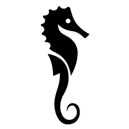
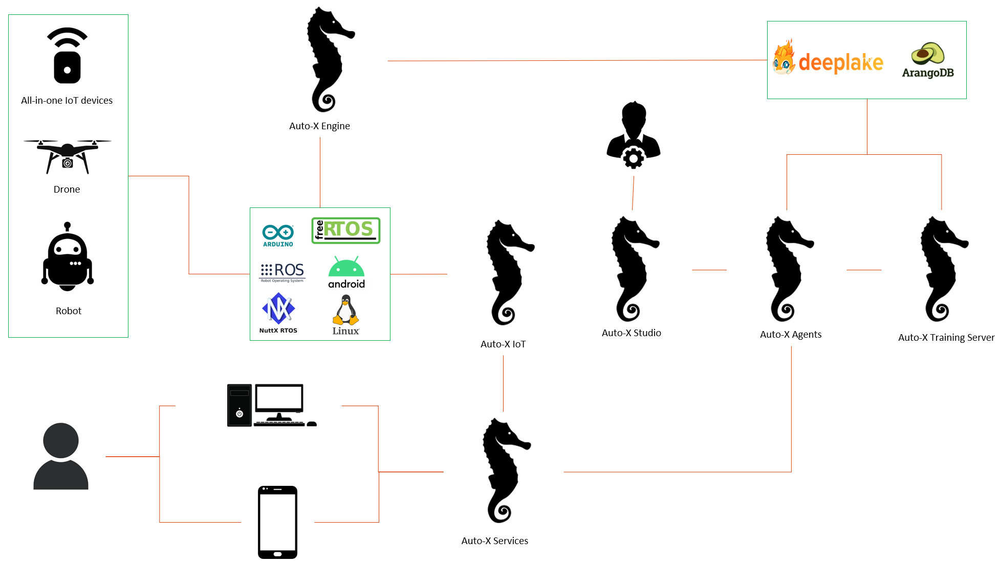

  

  <h1>Auto-X for Industries</h1>

Not stable for now. Please wait for the first release.

Auto-X for Industries is an autonomous solution that aims to solve the following challenges:

- High running cost and low efficiency for practical industrial uses with current AI services. Customers sometimes defer to use GPUs for some reasons.
- Difficult to annotate/pretrain/finetune for specific scenarios using private datasets with most of current AI services
- Insufficient accuracy and safety for industrial scenarios with current AI services. In some cases, you should use on-premise services only.
- Only part of the business processes can be automated with existing services. A mixed of AI serives can often reduce efficiency and accuracy. 

  

## Release Plans

- [Auto-X Engine](https://github.com/HairongWu/Auto-X-Engine) (based on NVIDIA Triton/ggml)

- [Auto-X Agent](https://github.com/HairongWu/Auto-X-Agent)
- [Auto-X Studio](https://github.com/HairongWu/Auto-X-Studio)

- [Auto-X IoT](https://github.com/HairongWu/Auto-X-IoT) (based on OpenRemote)
  
- [Beetle](https://github.com/HairongWu/Beetle) (powered by [PROON株式会社](https://www.proon.co.jp/))
- [Service Plans](https://github.com/HairongWu/Auto-X-Services)

## References and Acknowledgments

- [label-studio](https://github.com/HumanSignal/label-studio)
- [openremote](https://github.com/openremote/openremote)
- [Odoo](https://github.com/odoo/odoo)
- [OpenClinic GA](https://sourceforge.net/projects/open-clinic/)
- [Open Hospital](https://github.com/informatici/openhospital)
- [SWIRL AI Connect](https://github.com/swirlai/swirl-search)

- [label-studio-ml-backend](https://github.com/HumanSignal/label-studio-ml-backend)

- [RAGFlow](https://github.com/infiniflow/ragflow)
- [XAgent](https://github.com/OpenBMB/XAgent)
- [crewAI](https://github.com/joaomdmoura/crewAI)

- [VideoLLaMA 2](https://github.com/DAMO-NLP-SG/VideoLLaMA2)
- [anomalib](https://github.com/openvinotoolkit/anomalib)
- [EmoLLM](https://github.com/SmartFlowAI/EmoLLM)

- [PP-Structure](https://github.com/PaddlePaddle/PaddleOCR/tree/main/ppstructure)

- [Chronos](https://github.com/amazon-science/chronos-forecasting)

- [V-Express](https://github.com/tencent-ailab/V-Express)

- [ScrapeGraphAI](https://github.com/VinciGit00/Scrapegraph-ai)
- [crawl4ai](https://github.com/unclecode/crawl4ai)

- [Docs2KG](https://github.com/AI4WA/Docs2KG)
- [Extract, Define, Canonicalize](https://github.com/clear-nus/edc)

- [MetaGPT](https://github.com/geekan/MetaGPT)
- [aiXcoder](https://github.com/aixcoder-plugin/aiXcoder-7B)

- [Deep Lake](https://github.com/activeloopai/deeplake)
- [PPOCRLabelv2](https://github.com/PFCCLab/PPOCRLabel)