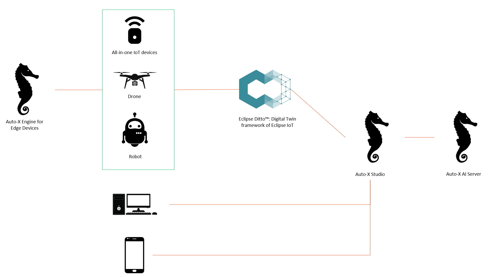

  

# Auto-X for Industries

Auto-X for Industries is a autonomous solution that aims to solve the following challenges:

- High running cost and low efficiency for practical industrial uses with current AI services. Customers often defer to use GPUs for some reasons.
- Difficult to annotate/pretrain/finetune for specific scenarios using private datasets with most of current AI services
- Insufficient accuracy and safety for industrial scenarios with current AI services. In some cases, you should use on-premise services only.
- Only part of the business processes can be automated with existing services

  

