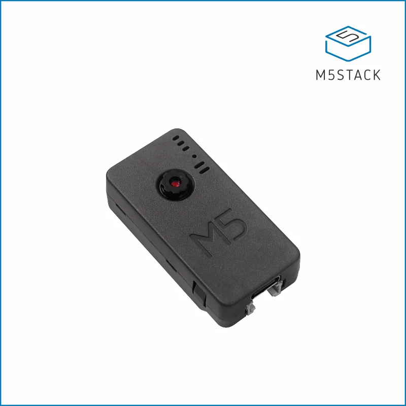
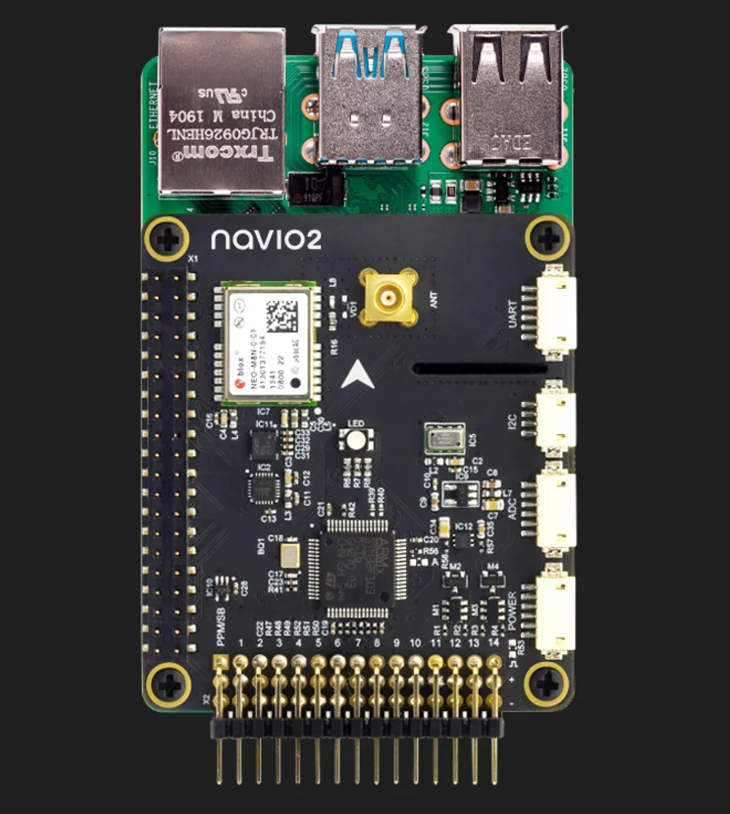

# Auto-X Engine

The Auto-X Engine is a deep learning inference engine designed for MCUs/CPUs. It is written entirely in C and runs on Auto-X private model format. Most of the codes are adapted from [ggml](https://github.com/ggerganov/ggml), [Paddle Lite](https://github.com/PaddlePaddle/Paddle-Lite),
[OpenCV](https://github.com/opencv/opencv), [onnx2c](https://github.com/kraiskil/onnx2c) and [llama2.c](https://github.com/karpathy/llama2.c).

This engine only supports the model structures described in this repo at this time. And these models are needed in the built-in solutions.

This repo also demonstrates how to connect ESP32 based cameras/PX4 based drones/Android based Robots to Auto-X Studio via MQTT using Auto-X Engine.

## Model Pool

> **Note** The following models could be modified from the originial ones.
> We also provide guidelines and running code to customize and retrain the following models using your own data.

### Models for MCU (such as ESP32 and Arm Cortex-M)

### Models for CPU (such as Arm Cortex-A and X86)

1. Llama2 & Llama3
   
The demo resides in the 'demos' folder with a MSVS project. As to the model downloading and other details, please refer to the following table:

| model | dim | n_layers | n_heads | n_kv_heads | max context length | parameters | val loss | download
| --- | --- | --- | --- | --- | --- | --- | --- | --- |
| 260K | 64 | 5 | 8 | 4 | 512 | 260K | 1.297 | [stories260K](https://huggingface.co/karpathy/tinyllamas/tree/main/stories260K)
| OG | 288 | 6 | 6 | 6 | 256 | 15M | 1.072 | [stories15M.bin](https://huggingface.co/karpathy/tinyllamas/resolve/main/stories15M.bin) |
| 42M| 512 | 8 | 8 | 8 | 1024 | 42M | 0.847 | [stories42M.bin](https://huggingface.co/karpathy/tinyllamas/resolve/main/stories42M.bin) |
| 110M| 768 | 12 | 12 | 12 | 1024 | 110M | 0.760 | [stories110M.bin](https://huggingface.co/karpathy/tinyllamas/resolve/main/stories110M.bin) |
  
2. Whisper

Please refer to [here](https://github.com/ggerganov/whisper.cpp) for details.

| Model  | Disk    | Mem     |
| ------ | ------- | ------- |
| tiny   | 75 MiB  | ~273 MB |
| base   | 142 MiB | ~388 MB |
| small  | 466 MiB | ~852 MB |
| medium | 1.5 GiB | ~2.1 GB |
| large  | 2.9 GiB | ~3.9 GB |

## Model Converter

- pytorch2autox
- huggingface2autox
- onnx2autox

## Demos

### Timer Camera X

Timer Camera X is a camera module based on ESP32, integrated with ESP32 chip and 8M-PSRAM. The camera (ov3660) with 3 million pixels , DFOV 66.5 ° and shoot 2048x1536 resolution photo, built-in 140mAh battery and LED status indicator, featuring ultra-low power consumption design. There is a reset button under the LED. Through RTC (BM8563), timing sleep and wake-up can be realized. The standby current is only 2μA. After timing photo taking function(one photo per hour) is turned on, the battery can work continuously for more than one month. The module supports Wi-Fi image transmission and USB port debugging. The bottom HY2.0-4P port output can be connected to other peripherals. 

  

Get more information about the hardware at [Timer Camera X](https://docs.m5stack.com/en/unit/timercam_x)

To send image data to Auto-X IoT, please refer to [here](./demos/M5StackTimerCamera/).

###  Raspberry Pi 4 Navio2

Get more information about the hardware at [Navio2](https://docs.px4.io/main/en/flight_controller/raspberry_pi_navio2.html)

  

This demo simulates the following industrial scenarios:

1. Schedule the drone to autonomously collect images of specified objects at some specified places with Auto-X Engine.
2. Exchange drone status with Auto-X IoT during the flight
3. Upload the collected images to Auto-X IoT when drone goes home

## References

- [PX4 Drone Autopilot](https://github.com/PX4/PX4-Autopilot)
- [M5_Camera_Examples](https://github.com/m5stack/M5_Camera_Examples/tree/main)
- [ESP32-S3-EYE](https://github.com/W00ng/ESP32-S3-EYE)
- [FreeRTOS](https://github.com/FreeRTOS/FreeRTOS)