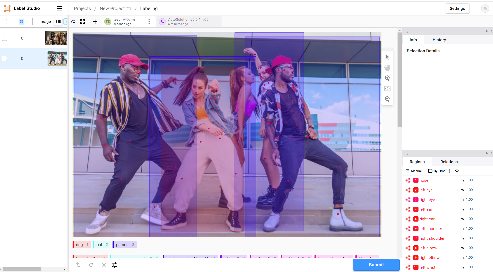

# Auto-X AI Server

Auto-X AI Server provides the built-in industrial autonomous use cases, such as:
- understand, recognize images/videos (what, where, how), and generate responses
- understand document structures and generate responses
- understand speeches and generate responses
- understand, recognize multi-modal data and generate responses
- understand time series data and generate responses

This projects is originally based on label-studio-ml-backend, so it is compatible with label-studio interfaces.
Auto-X AI Server supports three types of tasks: prediction tasks, training tasks and agent tasks.

## Connect with Label Studio for pre-labeling

1. Install [PyTorch](https://pytorch.org/) according to you hardwares

2. Install [Grounding DINO](https://github.com/IDEA-Research/GroundingDINO) and download the [model](https://github.com/IDEA-Research/GroundingDINO/releases/download/v0.1.0-alpha/groundingdino_swint_ogc.pth)

3. Install [UniPose](https://github.com/IDEA-Research/UniPose) and download the [model](https://drive.google.com/file/d/13gANvGWyWApMFTAtC3ntrMgx0fOocjIa/view)

4. Install other dependencies

```bash
pip install -r requirements.txt
```

5. Set the model paths and start server for test purpose

```bash
python _wsgi.py --log-level DEBUG --groundingdino_model xxx --pose_model xxx
```

6. Start up label studio and connect with this server for pre-labeling using this [label template](./label_templates/visual.xml)

<div  align="center">
  
</div>

## References

- [label-studio-ml-backend](https://github.com/HumanSignal/label-studio-ml-backend)
- [OneLLM](https://github.com/csuhan/OneLLM)
- [RAGFlow](https://github.com/infiniflow/ragflow)
- [XAgent](https://github.com/OpenBMB/XAgent)