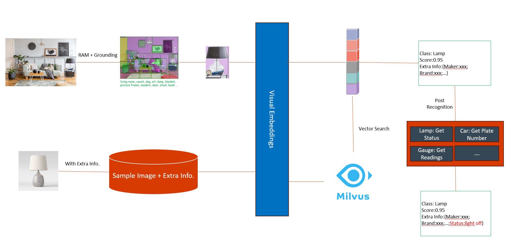

# Auto-X Service

Auto-X Service provides realtime interactive autonomous services via virtual agents based on webRTC and Auto-X AI server.
The full pipelines are provided using Auto-X stack, and you can build your own services from start.

## Remote Monitoring Anything (Visual)

  

## Document Intelligence

## Remote Monitoring Anything (Time Series)

## Auto Development

## Auto Finance

## Auto supply chain

## References

- [frePPLe](https://github.com/frePPLe/frepple)
- [FinGPT](https://github.com/AI4Finance-Foundation/FinGPT)
- [RAGFlow](https://github.com/infiniflow/ragflow)
- [XAgent](https://github.com/OpenBMB/XAgent)
- [Chronos](https://github.com/amazon-science/chronos-forecasting)
- [flutter-webrtc](https://github.com/flutter-webrtc/flutter-webrtc)