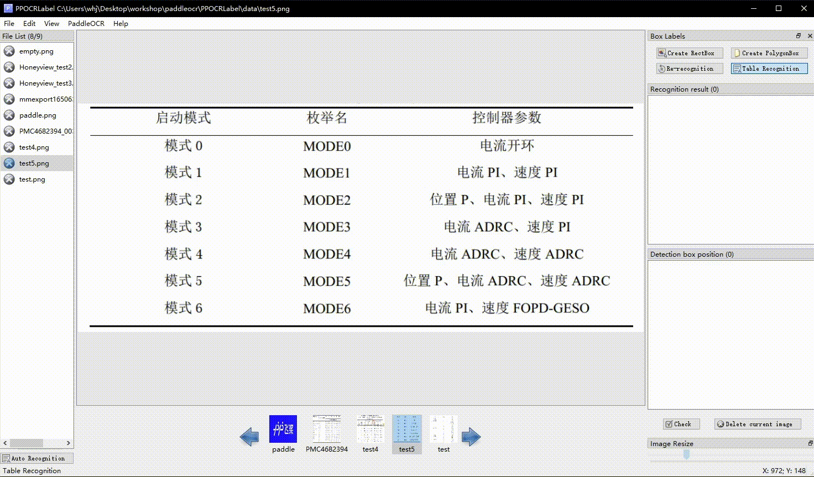
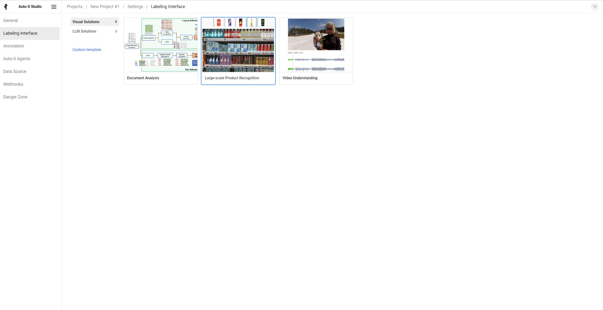
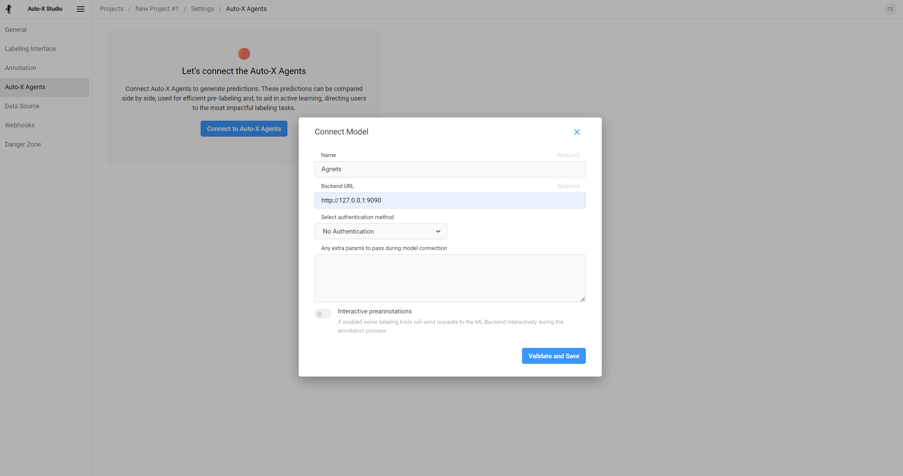

# Auto-X Studio

Auto-X Studio provides full workflows to build or finetune your own AI solution models.

## Create Document Dataset

|               regular text annotation               |                table annotation                |
| :-------------------------------------------------: | :--------------------------------------------: |
|     |  |
|            **irregular text annotation**            |         **key information annotation**         |
|  |    |

Build and Install the Whl Package Locally
```bash
cd ./PPOCRLabel
pip install -e .
```

### Steps

1. Build and launch using the instructions above.

2. Click 'Open Dir' in Menu/File to select the folder of the picture.<sup>[1]</sup>

3. Click 'Auto recognition', use PP-OCR model to automatically annotate images which marked with 'X' <sup>[2]</sup>before the file name.

4. Create Box:

   4.1 Click 'Create RectBox' or press 'W' in English keyboard mode to draw a new rectangle detection box. Click and release left mouse to select a region to annotate the text area.

   4.2 Press 'Q' to enter four-point labeling mode which enables you to create any four-point shape by clicking four points with the left mouse button in succession and DOUBLE CLICK the left mouse as the signal of labeling completion.

5. After the marking frame is drawn, the user clicks "OK", and the detection frame will be pre-assigned a "TEMPORARY" label.

6. Click 're-Recognition', model will rewrite ALL recognition results in ALL detection box<sup>[3]</sup>.

7. Single click the result in 'recognition result' list to manually change inaccurate recognition results.

8. **Click "Check", the image status will switch to "√",then the program automatically jump to the next.**

9. Click "Delete Image", and the image will be deleted to the recycle bin.

10. Labeling result: the user can export the label result manually through the menu "File - Export Label", while the program will also export automatically if "File - Auto export Label Mode" is selected. The manually checked label will be stored in *Label.txt* under the opened picture folder. Click "File"-"Export Recognition Results" in the menu bar, the recognition training data of such pictures will be saved in the *crop_img* folder, and the recognition label will be saved in *rec_gt.txt*<sup>[4]</sup>.

### Table Annotation
The table annotation is aimed at extracting the structure of the table in a picture and converting it to Excel format,
so the annotation needs to be done simultaneously with external software to edit Excel.
In PPOCRLabel, complete the text information labeling (text and position), complete the table structure information
labeling in the Excel file, the recommended steps are:

1. Table annotation: After opening the table picture, click on the `Table Recognition` button in the upper right corner of PPOCRLabel, which will call the table recognition model in PP-Structure to automatically label
    the table and pop up Excel at the same time.

2. Change the recognition result: **label each cell** (i.e. the text in a cell is marked as a box). Right click on the box and click on `Cell Re-recognition`.
   You can use the model to automatically recognise the text within a cell.

3. Mark the table structure: for each cell contains the text, **mark as any identifier (such as `1`) in Excel**, to ensure that the merged cell structure is same as the original picture.

    > Note: If there are blank cells in the table, you also need to mark them with a bounding box so that the total number of cells is the same as in the image.

4. ***Adjust cell order:*** Click on the menu  `View` - `Show Box Number` to show the box ordinal numbers, and drag all the results under the 'Recognition Results' column on the right side of the software interface to make the box numbers are arranged from left to right, top to bottom

5. Export JSON format annotation: close all Excel files corresponding to table images, click `File`-`Export Table Label` to obtain `gt.txt` annotation results.

### Note

[1] PPOCRLabel uses the opened folder as the project. After opening the image folder, the picture will not be displayed in the dialog. Instead, the pictures under the folder will be directly imported into the program after clicking "Open Dir".

[2] The image status indicates whether the user has saved the image manually. If it has not been saved manually it is "X", otherwise it is "√", PPOCRLabel will not relabel pictures with a status of "√".

[3] After clicking "Re-recognize", the model will overwrite ALL recognition results in the picture. Therefore, if the recognition result has been manually changed before, it may change after re-recognition.

[4] The files produced by PPOCRLabel can be found under the opened picture folder including the following, please do not manually change the contents, otherwise it will cause the program to be abnormal.

|   File name   |                         Description                          |
| :-----------: | :----------------------------------------------------------: |
|   Label.txt   | The detection label file can be directly used for PP-OCR detection model training. After the user saves 5 label results, the file will be automatically exported. It will also be written when the user closes the application or changes the file folder. |
| fileState.txt | The picture status file save the image in the current folder that has been manually confirmed by the user. |
|  Cache.cach   |    Cache files to save the results of model recognition.     |
|  rec_gt.txt   | The recognition label file, which can be directly used for PP-OCR identification model training, is generated after the user clicks on the menu bar "File"-"Export recognition result". |
|   crop_img    | The recognition data, generated at the same time with *rec_gt.txt* |

## Create Knowledge Graph Database

Open a terminal in the directory 'webprotege' and Use maven to package WebProtégé
```bash
mvn clean package
```
The WebProtege .war file will be built into the webprotege-server directory
Start the GWT code server in one terminal window
```bash
mvn gwt:codeserver
```
In a different terminal window start the tomcat server
```bash
mvn -Denv=dev tomcat7:run
```
Browse to WebProtégé in a Web browser by navigating to http://localhost:8080


## Other types of datasets

You can run the latest Auto-X Studio locally without installing the package. 
User docker for production purposes.

```bash
# Install all package dependencies
pip install poetry
poetry install
# Run database migrations
python label_studio/manage.py migrate
python label_studio/manage.py collectstatic
# Start the server in development mode at http://localhost:8080
python label_studio/manage.py runserver
```

### Workflow

1. Create a project and select the appropriate labeling template. Click 'Save'.
<div  align="center">
  
</div>

2. Start [Auto-X Agents](../agents) and Connect to Auto-X Agents
<div  align="center">
  
</div>

3. Go to the Data Manager, and import the data
4. Select 'Actions > Retrieve predictions'.
5. Select 'Actions > Create Annotations from Predictions'.
6. Confirm the pre-annotated data manually and modify if necessary
7. Start the [Auto-X Engine Server](https://github.com/HairongWu/Auto-X-Engine)(Not available for now)
8. Click 'Start Training' of dropdown menu of project settings.(Not available for now)

### Create Detect Anything Dataset


### Create LLM Dataset

### Create Video Captioning Dataset


### Create Dataset from Generative Models


### Create Dataset from Web Crawlers
